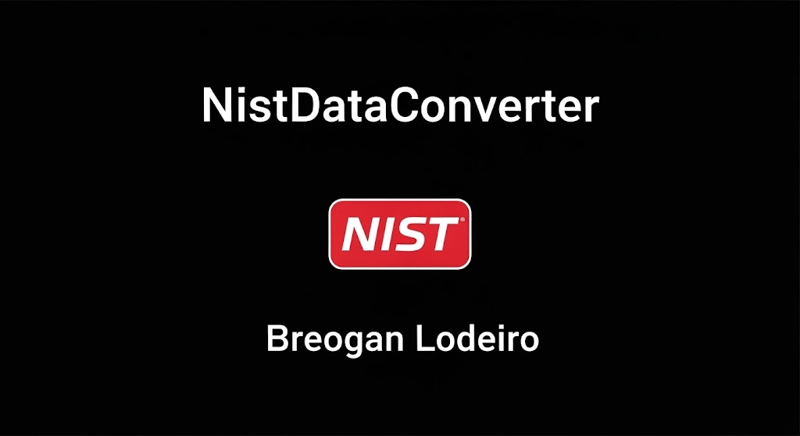

[Web Render](https://proyectodaw-drj5.onrender.com/)
---

# NistDataConverter - Un conversor de datos del NIST a JSON y CSV

Este documento es el guion que usaré para defender mi proyecto final del ciclo de Desarrollo de Aplicaciones Web.

## 1. Motivación

La idea de este proyecto salió de una necesidad que me encontré durante las prácticasTenía que consultar datos del NIST (National Institute of Standards and Technology) de forma automática y la primera solución fue un simple script de Python por consola. Funcionaba, pero no era nada cómodo de usar
**NistDataConverter** es la evolución de ese script. Quería llevarlo a una aplicación web completa, con una interfaz gráfica fácil de usar para que cualquiera, ya sean estudiantes o técnicos, pueda consultar, filtrar y exportar los datos de vulnerabilidades del NIST sin complicaciones
## 2. Demostración y Objetivos

A continuación, se realiza una demostración del funcionamiento de la aplicación en base a los objetivos comprometidos en el anteproyecto. Todos los objetivos han sido alcanzados: 
- **[✓] Conexión con la API del NIST**: La aplicación se conecta en tiempo real a la API pública del NIST para obtener datos actualizados.
- **[✓] Interfaz Web Intuitiva**: Se ha desarrollado un frontend claro y funcional con HTML, CSS y JavaScript, facilitando la interacción del usuario.
- **[✓] Implementación de Filtros Avanzados**: Los usuarios pueden refinar sus búsquedas por rango de fechas y nivel de severidad.
- **[✓] Visualización Estructurada de Resultados**: Los datos se presentan en la interfaz de forma ordenada para una fácil interpretación.
- **[✓] Exportación Flexible de Datos**: La funcionalidad de exportar a JSON y CSV está implementada y es plenamente funcional.
- **[✓] Mejora y Adaptación de Herramienta Existente**: Se ha evolucionado con éxito el script de consola original a una aplicación web robusta y accesible.

## 3. Descripción Técnica

#### a. Arquitectura de la aplicación y tecnologías utilizadas

La aplicación sigue una arquitectura cliente-servidor de 3 capas para separar responsabilidades y asegurar la escalabilidad. 
- **Capa de Presentación (Frontend)**: Construida con **HTML, CSS y JavaScript** estándar para asegurar la compatibilidad. Se ha utilizado **Bootstrap** para lograr un diseño responsive y profesional.
- **Capa de Lógica (Backend)**: Desarrollada en **Python** con el framework **FastAPI**, elegido por su alto rendimiento y su generación automática de documentación. La librería **Pandas** es clave para la manipulación y conversión de datos a CSV.
- **Capa de Datos**: La fuente de datos es la **API pública del NIST**. Los archivos para exportación (JSON y CSV) se generan al vuelo sin necesidad de una base de datos local.

#### b. Diagrama de Componentes

El siguiente diagrama ilustra las partes principales del sistema y cómo interactúan entre sí.


#### c. Diagrama de Flujo

Dado que no se utiliza base de datos, se presenta el diagrama de flujo que describe el recorrido de una petición.


## 4. Metodología de Desarrollo

El proyecto se gestionó con una **metodología incremental**, dividiendo el desarrollo en fases que entregaban partes funcionales del sistema. Este enfoque permitió flexibilidad, control continuo y una buena gestión del tiempo.

El flujo de trabajo se apoyó en **Git y GitHub** para el control de versiones, manteniendo el código principal (`main`) siempre estable. 
## 5. Diagrama de Gantt

#### Planificación Inicial (Anteproyecto)


#### Ejecución Final (Real)

```mermaid
#### Planificación Inicial (Anteproyecto)

```mermaid
gantt
    title Diagrama de Gantt - Planificación Inicial
    dateFormat  YYYY-MM-DD
    axisFormat  %d-%m-%Y

    section Fases del Proyecto
    Análisis de requisitos        :done, 2025-05-30, 2025-06-04
    Diseño técnico e interfaz     :done, 2025-06-05, 2025-06-10
    Iteración 1: Backend y API    :done, 2025-06-11, 2025-06-18
    Iteración 2: Frontend y filtros :done, 2025-06-19, 2025-06-26
    Iteración 3: Exportación y UI :done, 2025-06-27, 2025-07-03
    Pruebas y validación          :done, 2025-07-04, 2025-07-09
    Despliegue                    :done, 2025-07-10, 2025-07-11
    Documentación y presentación  :done, 2025-07-14, 2025-07-21
```

#### Ejecución Final (Real)


#### a. Análisis y justificación de las diferencias en las estimaciones.

Las desviaciones entre la planificación y la ejecución real fueron mínimas. La fase de desarrollo del backend se extendió ligeramente para comprender en profundidad la estructura de datos de la API del NIST. Sin embargo, este tiempo se recuperó en la fase de desarrollo del frontend, ya que el uso del framework Bootstrap agilizó la creación de una interfaz profesional y responsive. En general, la planificación inicial resultó ser precisa y realista.

## 6. Análisis de Tiempo Invertido (Estimado)

Al no utilizar una herramienta de seguimiento de tiempo, este análisis distribuye las **222 horas totales estimadas** del proyecto entre los módulos del ciclo formativo de **Desarrollo de Aplicaciones Web (DAW)** para justificar las competencias aplicadas.

#### a. Diagrama de tiempo invertido por componente y/o asignaturas


#### b. Análisis y justificación del tiempo invertido

- **EIE (60h)**: Es el bloque con más horas, ya que abarca la planificación, el análisis y toda la documentación del proyecto, tareas fundamentales para asegurar la calidad.
- **DWES (51h)**: Representa el núcleo técnico. El backend contiene la lógica de negocio y la comunicación con servicios externos, justificando su peso.
- **DIW (39h) y DWEC (36h)**: Suman una parte importante dedicada a crear una experiencia de usuario clara, funcional e interactiva.
- **ED (24h) y DAW (12h)**: Aunque son porcentajes menores, estas fases fueron críticas para asegurar la calidad del producto final y hacerlo accesible en un entorno real.

## 7. Presupuesto de la Aplicación

El proyecto se ha hecho intentando gastar lo mínimo, usando herramientas de código abierto y servicios con planes gratuitos.

| Concepto | Detalle | Coste Estimado | Justificación |
| :--- | :--- | :--- | :--- |
| **Recursos Humanos** | 1 Desarrollador (estudiante) | 0 € | El trabajo se enmarca en el proyecto final del ciclo formativo. |
| **Hardware** | Portátil de desarrollo propio | 0 € | Equipo ya amortizado. |
| **Software** | SO (Linux), IDE (VS Code), Git, Python, FastAPI, etc. | 0 € | Uso de software libre y de código abierto. |
| **Servicios en Línea**| Hosting (Render/Railway) | 0 € - 15 € | Se utiliza un plan gratuito para el despliegue. El coste estimado refleja un posible escalado a un plan básico. |
| **TOTAL** | | **0 € - 15 €** | **El coste directo del proyecto es prácticamente nulo.** |

## 8. Conclusiones

#### a. Posibles mejoras

El proyecto es una buena base, pero se podrían añadir nuevas funciones en el futuro:

- **Integración con más APIs**: Conectar con otras fuentes de datos (ej. CVE Details) para enriquecer la información.
- **Visualización de datos**: Añadir gráficos para analizar tendencias de vulnerabilidades. 
- **Sistema de notificaciones**: Implementar alertas por correo electrónico sobre nuevas vulnerabilidades. 
- **Cuentas de usuario**: Permitir a los usuarios guardar sus búsquedas personalizadas. 

#### b. Dificultades encontradas

- **Curva de aprendizaje inicial**: Aunque las tecnologías eran conocidas, dominar detalles específicos de la API del NIST y su estructura de datos requirió tiempo al principio.
- **Gestión del volumen de datos**: En consultas muy amplias, el rendimiento podría ser un desafío, por lo que se optimizó el backend para un procesamiento eficiente.
- **Desarrollo en solitario**: Asumir todos los roles del proyecto (gestor, analista, programador, tester) exigió una gran capacidad de organización.
